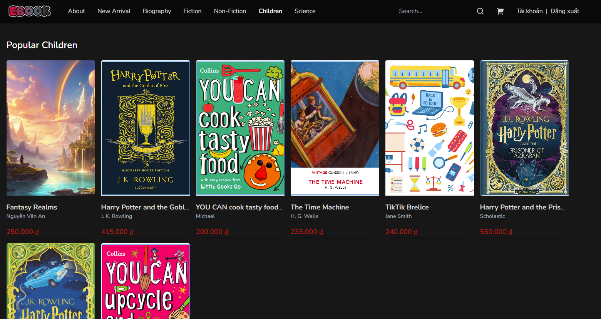
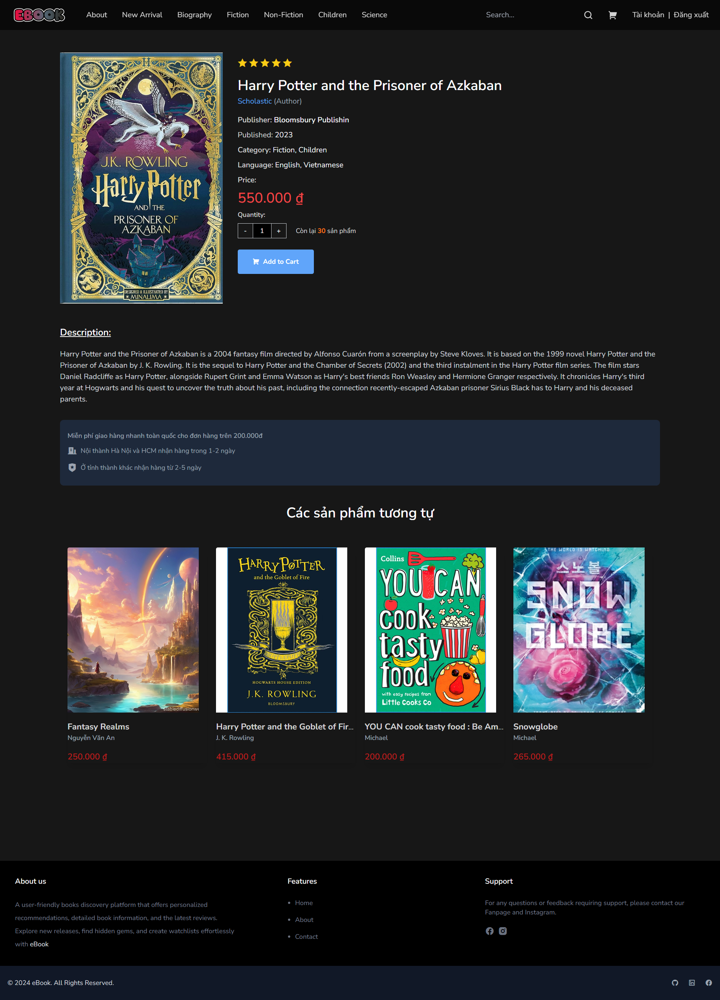
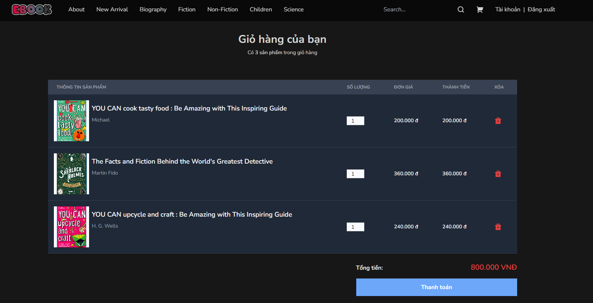
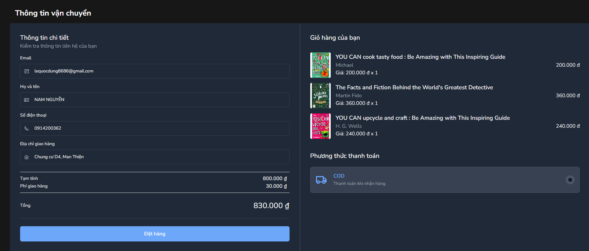

# eBook (Website for Client)
An eCommerce platform specializing in books, featuring personalized book recommendations to help readers discover their next favorite reads. With an extensive collection spanning multiple genres, we cater to diverse reading preferences.

## Features

- User-Friendly Interface.
- Diverse Range of Book Categories.
- Book Recommendations.
- Regularly Updated Inventory.
- Detailed Book Information.
- Add Products to the Shopping Cart
- Proceed to Checkout.
- Search Functionality.
- Manage profile.

## Requirement
- Runtime environment:
    - Node.js 20.10.0+.
    - MongoDB for database storage.
    - Firebase Storage for file storage.
    - Vercel for hosting.

- Development environment:
    - .NET 8.0+
    - React.js 18.2.0+ for frontend development.
    - Visual Studio 2022 or VS Code
    - Tailwind CSS for styling.
    - SQL Server 2019+ for database
      
## Installation Guide

To install and run the project locally, follow these steps:

1. Clone this repo.
2. Run `npm install` to install the dependencies.
3. Run `npm run dev` to start the server.

## User Interface

## Authors

[Lê Quốc Dũng](https://github.com/DungLe2983)

[Phạm Thanh Đồng ](https://github.com/ThanhDong00)

